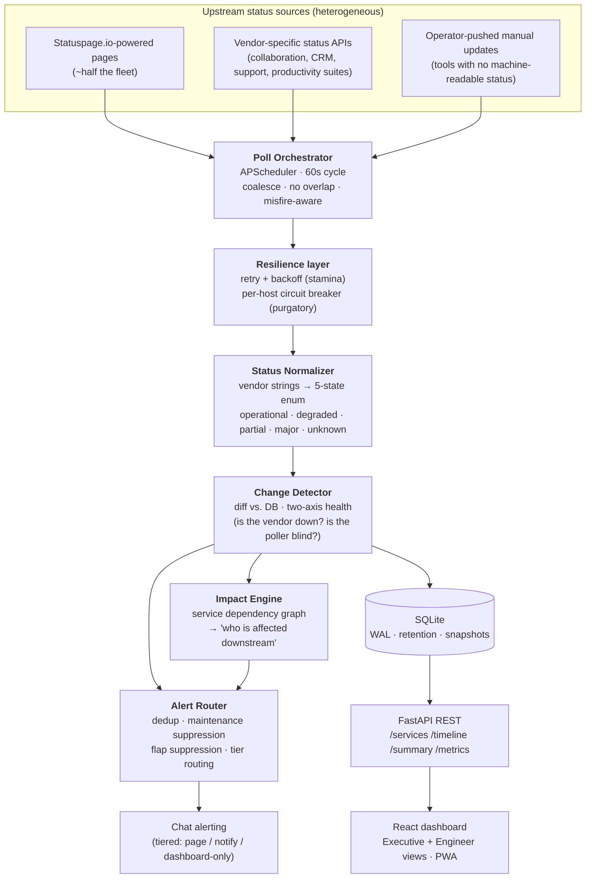

# Case Study: A Real-Time SaaS Status Dashboard for Enterprise IT

> **What it is:** A self-hosted service that polls the public status pages of ~30 enterprise SaaS
> tools every 60 seconds, normalizes a dozen incompatible vendor formats into one status model,
> detects changes, reasons about downstream impact, and alerts the operations team before the
> first user ticket lands.
>
> **Status:** v1 and v2 shipped. **356 tests passing.** ~16k LOC. Python 3.13 / FastAPI backend,
> React + Vite frontend, single-file SQLite datastore, runs on one Mac mini.

---

## The problem

In most IT organizations, the news that a critical SaaS tool is down travels in exactly the wrong
direction: a user hits a broken login, files a ticket, the ticket sits in a queue, and only then —
ten, twenty, sixty minutes later — does someone in IT realize the identity provider has been
degraded the whole time. The team learns about outages from the people it's supposed to be
protecting.

The information was public the entire time. Nearly every major SaaS vendor publishes a machine-readable
status page. The gap isn't data availability — it's that nobody is *watching* thirty status pages at
once, in thirty different formats, and connecting "Vendor X is degraded" to "therefore these internal
workflows are about to break."

This project closes that gap. It turns a reactive, ticket-driven posture into a proactive one: when a
vendor's own status page flips, the operations channel knows within one poll cycle — with an impact
statement attached, not just a raw status code.

---

## The solution

A small, self-contained monitoring service with five responsibilities, each isolated into its own
module so they can be tested and reasoned about independently:

**Flow in one sentence:** poll many formats → make them resilient and uniform → detect what
*changed* → decide who it *affects* and whether it's worth interrupting a human → store it and show it.

---

## Engineering highlights

These are the parts that are non-obvious — the places where the naive version is easy and the
correct version takes real design.

### 1. One status model out of a dozen vendor dialects

Every vendor describes "things are broken" differently. Statuspage.io alone has two distinct
vocabularies — a page-level *indicator* (`none` / `minor` / `major` / `critical`) and per-component
*status* strings (`operational` / `degraded_performance` / `partial_outage` / `under_maintenance`) —
and they don't line up. Other vendors ship entirely bespoke JSON. Manual operator updates use a
third shape.

The normalizer collapses all of it into a single five-state enum
(`operational · degraded · partial_outage · major_outage · unknown`) via explicit per-source mapping
tables. The design decision that matters: **an unrecognized vendor string maps to `unknown` and emits
a warning** — it never silently guesses `operational`. A new value a vendor introduces tomorrow shows
up as a logged anomaly instead of a false all-clear. (`under_maintenance`, notably, maps to `degraded`
rather than a fake outage — maintenance is expected, not an incident.)

### 2. Two-axis health: "is the vendor down?" vs. "is my poller blind?"

This is the insight that separates a toy from a tool. A status of `unknown` is dangerously ambiguous —
it could mean the vendor is genuinely in trouble, or it could mean *our own fetch failed* and we have
no idea what's going on. Conflating the two means every network hiccup looks like an outage.

So the system tracks **two orthogonal axes**:

- **Service status** — what the vendor reports (the 5-state enum above).
- **Poller health** — `healthy → degraded → broken`, driven by a pure state machine: a successful
  poll resets to `healthy`; failures short of a configurable threshold are `degraded`; sustained
  failure past the threshold flips to `broken`.

When a poller goes `broken`, that's routed as a *distinct* signal — "we've gone blind on this service" —
separate from a vendor-outage alert, because they demand different human responses. The UI renders a
broken poller differently from a down vendor. You always know whether you're looking at reality or at
a gap in your own instrumentation.

### 3. Resilience: heal fast, fail loud, don't hammer the dead

Every outbound request goes through one resilience layer with two complementary mechanisms:

- **Retry with backoff + jitter** (via `stamina`) for *transient* trouble — network errors, timeouts,
  and HTTP `408` / `429` / `5xx`. These self-heal, so the system gives them a few capped, jittered
  attempts before giving up.
- **Per-host circuit breaker** (via `purgatory`) for *persistent* trouble. After N consecutive
  failures a host's breaker opens and subsequent calls fast-fail for a TTL (default 5 minutes) before
  probing again — avoiding the classic "re-probe a dead host every cycle and burn the whole poll
  window" antipattern.

The sharp distinction: **HTTP `4xx` errors other than `408`/`429` are treated as hard failures and
surface immediately** — a `404` or `401` means a URL moved or auth changed; retrying can't fix config
rot, so it shouldn't mask it. And a tripped breaker is reported as *poller-unhealthy*, not
*vendor-down* — feeding straight back into the two-axis model above.

### 4. Alert quality: earn the interruption

A monitor that cries wolf gets muted, and a muted monitor is worthless. Several layers cooperate so
that a human is interrupted only when it's warranted:

- **Deduplication keyed on `(service, vendor_incident_id)`** — with a `(service, status, day)`
  fallback when no vendor incident ID exists. Critically, **dedup never keys on message text**:
  vendors edit incident titles mid-flight, and a text key would leak a fresh alert on every wording
  change.
- **Maintenance-window suppression** — a scheduled maintenance records the state transition but does
  not page anyone. Expected ≠ alarming.
- **Flap suppression** — a status must persist across a configurable number of confirming polls before
  a worsening alert fires, and recover across another threshold before the all-clear, so a vendor
  bouncing between states doesn't machine-gun the channel.
- **Tiered routing** — every service has a tier: `critical` pages with an `@here` mention,
  `important` notifies without the mention, `informational` updates the dashboard and sends nothing.
- **Dependency correlation** — when one upstream failure knocks out several dependents, the router can
  emit a *single aggregated* upstream alert instead of N separate downstream ones.

Every decision — sent or suppressed, and why — is written to a durable audit log. There's always an
answer to "what did we tell operators, and what did we hold back?"

### 5. From "Vendor X is degraded" to "here's who it hurts"

Raw status is low-value; *impact* is what an on-call human actually needs. A service dependency graph
(stored relationally, queried both upstream and downstream and ordered by severity) lets the impact
engine turn a single vendor event into a downstream blast-radius statement — "identity provider
degraded → these dependent workflows are at risk" — so the alert leads with consequences, not codes.

### 6. Scheduler discipline and observability

The poll loop is built to stay honest under load and to be debuggable in production:

- **Scheduler safety**: cycles `coalesce` (a late wake-up runs once, not as a backlog stampede),
  `max_instances=1` (a slow cycle is skipped, never overlapped), and missed runs are logged and
  counted rather than silently dropped.
- **Trace-without-tracing**: each cycle binds a fresh `poll_cycle_id` into structured logs, so every
  line from one cycle is correlatable without a full distributed-tracing stack.
- **Operational signals**: a Prometheus `/metrics` endpoint (poll counts, durations, circuit-breaker
  state, alert sent/suppressed counters), optional Sentry error tracking, and a Healthchecks.io
  dead-man's-switch heartbeat that screams if the *monitor itself* goes dark.

### 7. Boring, durable data lifecycle

A single SQLite file in WAL mode is the whole datastore — deliberately. Around it: production pragmas,
automatic retention purges for event and alert-log tables, a daily `VACUUM INTO` snapshot, and
optional Litestream continuous replication. No database server to operate; full point-in-time recovery
if the host dies.

---

## Results / status

- **v1 (demo-ready) — shipped.** Polling, normalization, change detection, chat alerting, the React
  UI, dependency graph, timeline, SLA tracking, incident clustering, and automated reports.
- **v2 (production-ready) — shipped.** Bearer-token auth on admin endpoints; the full resilience
  layer (retry + circuit breaker); alert-quality stack (flap suppression, dedup, tier routing,
  dependency correlation, maintenance windows); observability (structured logging, Prometheus, Sentry,
  dead-man's switch); data lifecycle (retention, snapshots, replication); a productionized UI with a
  severity-sorted grid, an Executive/Engineer view toggle, accessibility + keyboard navigation, and
  PWA support; and platform polish (CI, pre-commit hooks, a hardened launchd service, a Caddy reverse
  proxy, and OS-keychain-backed secrets).
- **Quality gate:** **356 automated tests passing**, covering the normalizer, resilience layer,
  change detector, alert routing, dependency graph, SLA math, the REST API, and a full end-to-end
  pipeline test.
- **Footprint:** runs comfortably on a single Mac mini. One Python process, one SQLite file, one
  static React bundle served by the same app.
- **What it watches:** ~30 enterprise SaaS tools spanning identity & access, productivity & content,
  collaboration, engineering & ITSM, HR & people, finance, CRM, marketing, network/VPN, and support —
  a representative cross-section of a modern enterprise SaaS estate.

A set of features (inbound vendor webhooks, a chat acknowledgement flow, auto-drafted SRE-style
postmortems on recovery, and multi-burn-rate SLO alerting) is built and tested but kept behind feature
flags, defaulting off until their deployment prerequisites are in place — shipped code, deliberately
dark.

---

## Skills demonstrated

Framed for a Platform / DX / AI-infrastructure audience:

- **Distributed-systems resilience as a first-class concern, not an afterthought.** Retries with
  backoff + jitter, per-host circuit breaking, and a deliberate transient-vs-permanent failure
  taxonomy — the same patterns that keep a platform's outbound integrations from amplifying a
  dependency's bad day.
- **Designing the right abstraction over messy reality.** Collapsing a dozen incompatible vendor
  formats into one clean status model — with a fail-safe `unknown` path — is the everyday work of
  platform and integration engineering.
- **Signal quality over signal volume.** The dedup / suppression / tiering / correlation stack is an
  alerting-discipline story: respect the human on the other end, and the system stays trusted instead
  of muted.
- **Observability built in from the start.** Structured logs with cycle correlation, Prometheus
  metrics, error tracking, and a dead-man's switch — designed to be operated, not just run.
- **Production data discipline at small scale.** WAL, retention, snapshots, and replication on a
  single-file datastore: maximum durability for minimum operational surface.
- **Test rigor.** 356 tests including pure-function state-machine coverage and an end-to-end pipeline
  test — the difference between "it worked on my machine" and "it's safe to change."
- **Shipping judgment.** Feature-flagged, default-off capabilities show the discipline to merge
  complete-but-not-yet-deployable work without destabilizing what's live.

The throughline: this is enterprise IT pain, solved with platform-engineering tools — turning a
reactive, ticket-driven workflow into a proactive, observable, self-healing system.
